# infrastructure
- ***apache iceberg with minio:*** https://blog.min.io/a-developers-introduction-to-apache-iceberg-using-minio/
- docker compose
- oauth2 provider for the enduser
- aws with localstack
- frontend with react
- docker compose and localstack
- minio for ai-storage
- GraphQl and go as backend restFul Api
- siem with Elasticstack
- traefik as reverseproxy for local deployment and docker compose
- grafana monitoring
- gitops with argo
- *AWS email* service
- *AWS Route53* loadbalancer via localstack
- *AWS S3* with localstack
- *AWS Api Gateway* for restFul Api (GraphQL and redis) with localstack
- *AWS EC2* instance with localstack for frontend
- *AWS Elastic Container Registry* for fas container deployments 
- *AWS LAmbda* - the deployments are for admins and private services. they are for development and they come with a python runtime and the most needed machine learnng tools like pytorch and tensorflow
- AWS firewall and Cloudsecurity with Localstack - here are several options like AWS Network Firewall,AWS Security Groups, Shield, WAF,  Firewall Manager, AWS Network ACLs, AWS VPC Flow Logs

- seperated buckets for frontend and backend
- kafka with localstack
- github actions for ci/cd including code analysis with checkov (add a github actions workflow)
- awaiting code check and reviews
- pytorch and ml frameworks deplplpoyed via containers in docker compose and aws lambda. ec2 instance with localstack for frontend
- ratelimiter (aws api gateway or traefik)
- oauth2 acl for certain subdomains and services via api gateway for training and private applications, or applications that are in development
- Iam roles for admin for private services in aws
- useraccounts for onprem and aws services
- postgres 
- cicd pipeline sand react router for fluid deploiments
- redis caching

- OPTIONAL! WAF/Shield Alternative === ModSecurity (NGINX/Traefik Plugin) + Suricata (IDS)
- OPTIONAL! AWS VPC/Networking alternative === Calico (Netzwerk-Policies) + Open vSwitch
- terraform and ansible iac deployements
- gitOps with ArgoCd(multi workspace for 2. repo named pjHub_gitOps)
- training of multiple models for several applications like html generator, malarias self played game, self hosted deepseek r1 instance and several models from hugging face
- dashboard for training in the frontend for admins
- starting training and roll back via dashboard
- start applications from the website
postgres with redis and  

# applications
## ji's httml generator and editor
- html generator with react and typescript
- create a api endpoint or service for the model that can be called from the frontend
. the model can use code + commands as input for the html code generation
- GraphQl Api Endpoint
- sql db entries with redis caching for the api calls

## marlaria's slAI-the-spire  🚀
Maybe create an AI model trained on slay the spire content, after that feed it screenshots of someone playing and let the ai make all the descicions and see what it does 
- create backend using postgres for the user 
- redis for caching
- datastorage for machne learning with minio 
- training with pytorch and 
- GraphQl Api Endpoint
- sql db entries with redis caching for the api calls


# Docs
- create uml diagrams 
- create documentation for the applications
- create a api documentationns
- create docs for the backend
- create docs for the frontend
- create docs for the GraphQl Api Endpoint with acl, ratelimiter, aws/traefik implementation
- create docs for the sql db entries with redis caching for the api calls
- create docs for the different ml snippets, models, frameworks and apis used in the applications and backend


## Infra Diagram

```mermaid
flowchart TD
    %% Infrastructure Diagram
    classDef storage fill:#FF9999,color:#000000,stroke:#FF6666
    classDef compute fill:#99FF99,color:#000000,stroke:#66CC66
    classDef security fill:#9999FF,color:#000000,stroke:#6666CC
    classDef monitoring fill:#FFFF99,color:#000000,stroke:#CCCC66
    classDef cd fill:#FF99FF,color:#000000,stroke:#FF66FF

    %% Core Components
    subgraph OnPrem["On-Premises/Development Environment"]
        A[MinIO]:::storage --> B[Apollo Iceberg Tables]:::storage
        C[PostgreSQL]:::compute --> B
        D[Redis]:::compute --> E[Go Backend]:::compute
        F[Traefik]:::compute --> G[React Frontend]:::compute
        F --> E
        H[Kafka]:::compute --> I[ML Training]:::compute
        J[Elastic SIEM]:::monitoring --> K[Grafana]:::monitoring
    end

    %% AWS Services
    subgraph AWS["AWS Services (LocalStack Emulation)"]
        L[API Gateway]:::compute --> E
        M[EC2]:::compute --> G
        N[Lambda]:::compute --> I
        O[S3]:::storage --> A
        P[Route53]:::compute --> F
        Q[IAM]:::security --> R[ECR]:::compute
    end

    %% Security Layer
    subgraph Security["Security Components"]
        S[Keycloak]:::security --> T[ACL]:::security
        U[Calico]:::security --> V[Open vSwitch]:::security
        W[ModSecurity]:::security --> F
        X[Suricata]:::security --> J
    end

    %% CI/CD Pipeline
    subgraph CD["CI/CD Pipeline"]
        Y[GitHub Actions]:::cd --> Z[ArgoCD]:::cd
        Z --> AA[Podman/K8s]:::compute
        Y --> AB[Security Scan]:::cd
    end

    %% Applications
    subgraph Apps["Applications"]
        AC[Ji's HTML Generator]:::compute --> AD[GraphQL]:::compute
        AE[Marlaria's SlAI]:::compute --> AF[PyTorch Model]:::compute
        AF --> B
    end

    %% Styling
    classDef storage fill:#FF9999,color:#000000,stroke:#FF6666
    classDef compute fill:#99FF99,color:#000000,stroke:#66CC66
    classDef security fill:#9999FF,color:#000000,stroke:#6666CC
    classDef monitoring fill:#FFFF99,color:#000000,stroke:#CCCC66
    classDef cd fill:#FF99FF,color:#000000,stroke:#FF66FF
```


## example  for aws lambda python environment

```python
import boto3
import torch
import pandas as pd
s3 = boto3.client('s3')
def lambda_handler(event, context):
    model_file = s3.get_object(Bucket='my-bucket', Key='my-model.pt')
    model = torch.load(model_file['Body'])
    data_file = s3.get_object(Bucket='my-bucket', Key='my-data.csv')
    data = pd.read_csv(data_file['Body'])
    predictions = model(data)
    s3.put_object(Body=predictions, Bucket='my-bucket', Key='my-results.csv')
    return {
        'statusCode': 200,
        'body': 'Results saved successfully!'
    }
```

## forked by ji
- will get moved to pamji hub 


