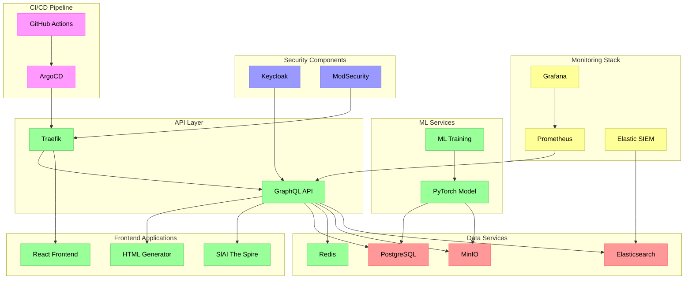

# PjHub
Core Features

***Hybrid Infrastructure:*** Combination of on-premises (MinIO, PostgreSQL) and AWS emulation via LocalStack
ML Pipeline: End-to-end training and hosting of PyTorch models

***Two Main Applications:***
- HTML Generator: ML-powered code generation with React frontend
- SlAI The Spire: Game AI with decision-making model

## Tech Stack

### Backend Services
- GraphQL API with TypeScript & Apollo Server
- PostgreSQL 16 for persistent storage
- Redis 7 for caching and session management
- MinIO S3-compatible object storage
- LocalStack for AWS service emulation
- Elasticsearch 8.11 for logging and search
- PyTorch for ML model training and inference

### Frontend
- React 18 with TypeScript
- Tailwind CSS for styling
- Apollo Client for GraphQL integration
- Vite for build tooling
- React Router for navigation

### Infrastructure & Monitoring
- Traefik 2.4 for reverse proxy and load balancing
- Grafana/Prometheus for metrics and monitoring
- OpenTelemetry for distributed tracing
- Keycloak for authentication and authorization
- ModSecurity WAF for security
- ArgoCD for GitOps deployments
- Terraform for infrastructure provisioning

## Container Services

The project uses the following containers:

### Core Services
- `htmlgen-frontend`: HTML Generator React frontend
- `htmlgen-api`: HTML Generator GraphQL API
- `slaithespire-ml`: ML model training service
- `slaithespire-api`: Game AI API service
- `graphql-api`: Main GraphQL API gateway

### Data Storage
- `postgres`: PostgreSQL database (v16)
- `redis`: Redis cache server
- `minio`: MinIO object storage
- `elasticsearch`: Elasticsearch server

### Infrastructure
- `traefik`: Traefik reverse proxy
- `grafana`: Metrics visualization
- `prometheus`: Metrics collection
- `localstack`: AWS services emulation
- `keycloak`: Authentication server

### Development Tools
- `argocd`: GitOps deployment tool
- `vault`: Secrets management

## Development Setup
### Getting Started
1. Clone the repository
2. Install dependencies:
```bash
# Frontend dependencies
cd frontend && npm install
cd ../apps/html_generator && npm install

# Backend dependencies
cd ../../backend/graphql && npm install
```

3. Start services:
```bash
docker-compose -f docker/docker-compose.yml up
```

### Available Workflows
- **Terraform Deploy**: Deploy infrastructure components
- **Generate Docs**: Generate architecture documentation
- **Train Model**: Execute ML model training
- **ArgoCD Deploy**: Deploy with ArgoCD
- **AWS Deploy**: Deploy AWS resources

### Development Commands
```bash
# Build HTML Generator
./scripts/build_htmlgen.sh

# Build SlAI The Spire
./scripts/build_slaithespire.sh
```

## Project Structure
```
PjHub
├── .github/                    # GitHub Actions workflows
├── apps/                       # Main applications
│   ├── html_generator/         # HTML generation app
│   │   ├── public/            # Static assets
│   │   └── src/               # Source code
│   └── slay-the-spire/        # Game AI project
│       └── src/               # Source code & ML models
├── backend/                    # Backend services
│   └── graphql/               # GraphQL API
│       ├── config/            # Service configurations
│       └── schema/            # GraphQL schema definitions
├── docs/                       # Documentation
│   ├── api.md                 # API documentation
│   ├── architecture.md        # System architecture
│   └── ml.md                  # ML components docs
├── frontend/                   # Main frontend app
│   ├── public/                # Static assets
│   └── src/                   # Source code
├──                     # Infrastructure configs
│   ├── docker/                # Container configurations
│   ├── grafana/               # Monitoring & dashboards
│   ├── postgres/              # Database configs
│   └── redis/                 # Cache configs
├── IaC/                       # Infrastructure as Code
│   ├── ansible/               # Configuration management
│   │   └── argocd/           # ArgoCD configurations
│   └── terraform/             # Infrastructure specs
│       └── modules/           # Terraform modules
├── scripts/                   # Utility scripts
└── tests/                     # Test suites
```

## Monitoring
Access Grafana dashboards at http://0.0.0.0:3000 for:
- System metrics
- Service health
- Application performance
- Infrastructure status

## Local Development
Start the development environment:
```bash
docker-compose -f docker/docker-compose.yml up
```

## Admin Dashboard
Access the admin interface at `/admin` for:
- System monitoring
- Cache management
- ML model training controls
- Infrastructure metrics


## Applications

### HTML Generator
A React/TypeScript-based frontend for HTML code generation featuring:
- Interactive UI with drag-and-drop components
- GraphQL API integration
- PostgreSQL storage with Redis caching
- ML-powered code generation model

### SlAI The Spire
A PyTorch-based game AI implementation including:
- Game state analysis and decision making
- User data storage in PostgreSQL
- State caching with Redis
- ML model storage using MinIO

## Architecture Diagram
