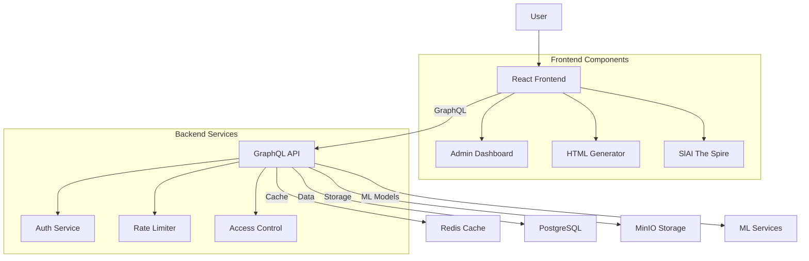

# PjHub System Architecture

## System Components

1. Frontend (React)
   - Admin Dashboard
   - HTML Generator
   - SlAI The Spire Game

2. Backend (GraphQL + Go)
   - Authentication & Authorization
   - Rate Limiting
   - Access Control Lists
   - ML Model Integration

3. Storage
   - PostgreSQL for structured data
   - Redis for caching
   - MinIO for file storage
