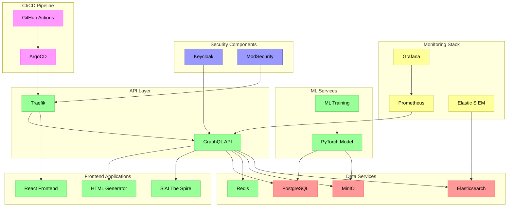

# PjHub System Architecture

## Component Overview

### Frontend Applications
- React-based main interface
- HTML Generator tool
- SlAI The Spire game interface

### API Layer
- Traefik for routing and load balancing
- GraphQL API gateway
- Service mesh integration

### Data Services
- PostgreSQL for persistent storage
- Redis for caching
- MinIO for object storage
- Elasticsearch for logging and search

### ML Services
- PyTorch model training
- ML inference API
- Model storage and versioning

### Monitoring
- Grafana dashboards
- Prometheus metrics
- Elastic SIEM for security monitoring

### Security
- Keycloak authentication
- ModSecurity WAF
- Access control and encryption

### CI/CD Pipeline
- GitHub Actions automation
- ArgoCD GitOps deployment
- Continuous monitoring and testing
